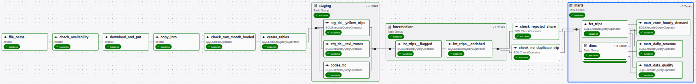
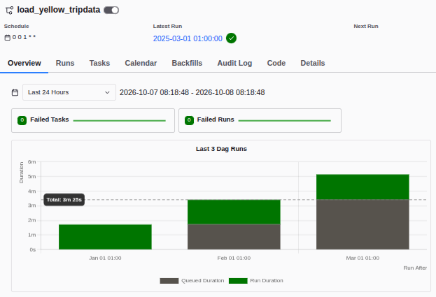

# Pipeline médaillon NYC Yellow Taxi — Snowflake et Airflow

Hudson Cab Partners, opérateur de 180 taxis jaunes à New York, préparait ses analyses mensuelles à la main dans des notebooks. Ce dépôt les remplace par un entrepôt Snowflake et un pipeline Airflow qui, chaque mois, charge le fichier public de la TLC, exécute les transformations SQL de l'analyste dans le bon ordre, contrôle la qualité des données et alimente les tables d'analyse. Il répond, de façon rejouable, à la question de la direction : **où et quand la demande est-elle la plus forte, et combien rapporte un trajet selon la zone, l'heure et le mode de paiement ?** La réponse est dans [`docs/REPONSE.md`](docs/REPONSE.md).

Périmètre : janvier, février et mars 2025, soit 11 198 026 trajets chargés et 10 382 378 trajets valides dans la table de faits.

## Le pipeline en un schéma


| Partie du schéma | Rôle | Dans ce dépôt |
|---|---|---|
| **Sources publiques (TLC)** | Un fichier Parquet par mois (3,5 M de lignes, 60 Mo) et un CSV de 265 zones. Fiche source : [`docs/fiche_trajets.md`](docs/fiche_trajets.md). | téléchargés dans `data/` (ignoré par Git) |
| **Airflow, le chef d'orchestre** | Une exécution traite un mois : vérifier que le fichier est publié, le télécharger et l'envoyer sur le stage, le copier dans RAW sans doublon, puis exécuter les SQL et les contrôles. Un contrôle qui échoue arrête la suite. | `airflow/dags/load_yellow_tripdata.py`, projet Astro (Airflow 3) |
| **Snowflake, l'entrepôt** | Une base `NYC_TAXI`, quatre schémas, un warehouse XS à suspension automatique, un rôle `TRANSFORMER` limité et un utilisateur de service `AIRFLOW_SVC` authentifié par clé. | `snowflake/01` à `06` |
| **Stage** | Zone de dépôt des fichiers avant leur copie dans une table (`PUT` puis `COPY INTO`). | `NYC_TAXI.RAW.TLC_STAGE` |
| **RAW (bronze)** | Copie fidèle des fichiers, sans filtre ni jointure, plus le nom du fichier d'origine et la date de chargement. | `CONTRAT_RAW.md`, `snowflake/05_raw_objects.sql` |
| **STAGING (argent)** | Vues de renommage et de typage, une ligne par ligne RAW ; tables de codes TLC. | `airflow/include/sql/staging/` |
| **INTERMEDIATE** | Chaque trajet reçoit au plus une raison de rejet (la première règle qui échoue), puis les trajets valides sont enrichis. | `airflow/include/sql/intermediate/` |
| **MARTS (or)** | Table de faits `FCT_TRIPS`, cinq dimensions, trois tables d'analyse (demande par zone et heure, recette quotidienne, qualité des données). | `airflow/include/sql/marts/` |
| **Consommation** | La requête qui répond à la direction, son top 10 et ses limites. | `docs/REPONSE.md` |

## Arborescence

```
.
├── README.md
├── CONTRAT_RAW.md                 noms et colonnes imposés à la couche RAW
├── ETAPES.md                      le brief jour par jour (kit de départ)
├── verifier_poste.sh              vérifie Python, Git, Docker, Astro CLI, OpenSSL
├── .env.example                   variables du poste (compte Snowflake, chemin de la clé)
├── adr/                           décisions d'architecture (rejeu du chargement, code partagé)
├── snowflake/                     scripts SQL à lancer dans Snowsight, dans l'ordre
│   ├── 01_infrastructure.sql      rôle, warehouse, base, schémas, droits, utilisateur de service
│   ├── 02_service_user_key.sql    clé publique de l'utilisateur de service
│   ├── 03_verify_access.sql       ce que le rôle des outils peut et ne peut pas faire
│   ├── 04_verify_raw_contract.sql la couche RAW respecte le contrat
│   ├── 05_raw_objects.sql         formats de fichier, stage, tables RAW
│   ├── 06_raw_parquet_logical_types.sql  réparation d'une installation antérieure au correctif
│   ├── 07_verify_data_quality.sql recompte des trajets anormaux contre MART_DATA_QUALITY
│   └── 08_credits_consumed.sql    crédits consommés (ACCOUNTADMIN)
├── airflow/                       projet Astro
│   ├── Dockerfile, requirements.txt, packages.txt, .env.example
│   ├── dags/
│   │   ├── load_yellow_tripdata.py       le pipeline, un run par mois
│   │   └── check_snowflake_connection.py un DAG d'une tâche pour prouver la connexion
│   ├── include/
│   │   ├── snowflake_loader.py    session par clé, PUT, COPY INTO (partagé scripts et DAG)
│   │   ├── tlc.py                 nom et URL du fichier d'un mois, téléchargement
│   │   ├── load_month.py          charger un mois depuis le poste
│   │   ├── load_zones.py          charger les zones depuis le poste (une fois)
│   │   ├── check_connection.py    vérifier la connexion depuis le poste
│   │   ├── requirements.txt       dépendances des scripts du poste
│   │   └── sql/                   les fichiers SQL fournis et les trois contrôles
│   └── tests/dags/                tests de structure du DAG (dans l'image)
├── tests/                         tests des modules du poste
└── docs/
    ├── architecture.png, parcours.png
    ├── fiche_trajets.md           fiche source des trajets
    ├── REPONSE.md                 la réponse à la direction
    └── captures/                  exécutions, graphe, contrôle en échec, droits, crédits
```

Le kit prévoyait un dossier `ingestion/` pour le script du poste ; il vit dans `airflow/include/` pour que le DAG et le script partagent le même code de chargement ([ADR-0002](adr/0002-emplacement-code-partage-scripts-dag.md)).

## Prérequis

- Linux ou macOS ; sous Windows, Ubuntu dans WSL avec le projet dans le dossier personnel (`~`), pas sous `/mnt/c` : les droits du fichier de clé n'y fonctionnent pas.
- Docker Engine (Docker Desktop n'est pas nécessaire ; s'il est installé, `docker context use default` avant de démarrer Airflow).
- [Astro CLI](https://www.astronomer.io/docs/astro/cli/install-cli), Python 3.12 ou plus avec [uv](https://docs.astral.sh/uv/), Git, OpenSSL.
- Un compte Snowflake (un compte d'essai suffit) avec le rôle `ACCOUNTADMIN` pour l'installation.

Avant de commencer : `bash verifier_poste.sh`, tout doit afficher `OK`.

## Installation pas à pas

### 1. Snowflake : l'infrastructure

Dans Snowsight, connecté comme administrateur, ouvrir et lancer (`Run All`) `snowflake/01_infrastructure.sql`. Il crée le rôle `TRANSFORMER`, le warehouse `NYC_TAXI_WH` (XS, suspension après 60 s), la base `NYC_TAXI` et ses schémas `RAW`, `STAGING`, `INTERMEDIATE`, `MARTS`, les droits du rôle et l'utilisateur de service `AIRFLOW_SVC`. Il est rejouable : tout est en `IF NOT EXISTS`.

### 2. La paire de clés du service

Sur le poste qui lancera les outils :

```bash
mkdir -p ~/.ssh/snowflake && cd ~/.ssh/snowflake
openssl genrsa 2048 | openssl pkcs8 -topk8 -inform PEM -out rsa_key.p8 -nocrypt
openssl rsa -in rsa_key.p8 -pubout -out rsa_key.pub
chmod 600 rsa_key.p8
grep -v "BEGIN\|END" rsa_key.pub | tr -d '\n'; echo
```

Coller la clé publique affichée dans `snowflake/02_service_user_key.sql` **dans la feuille Snowsight seulement**, jamais dans le fichier du dépôt, puis lancer le script. La clé privée ne quitte pas `~/.ssh/snowflake/`.

### 3. Vérifier les droits, créer la couche RAW

- `snowflake/03_verify_access.sql`, bloc par bloc : le rôle a exactement 15 droits, chacun fonctionne, et huit instructions hors périmètre sont refusées.
- `snowflake/05_raw_objects.sql`, `Run All` avec le rôle `TRANSFORMER` : formats de fichier, stage et les deux tables RAW, conformes à `CONTRAT_RAW.md`. (`06` ne sert qu'à réparer une installation faite avant le correctif des horodatages Parquet ; inutile sur une installation neuve.)

### 4. Le poste : variables et connexion

```bash
cp .env.example .env            # renseigner SNOWFLAKE_ACCOUNT (identifiant ORGANISATION-COMPTE)
uv run --env-file .env --with-requirements airflow/include/requirements.txt \
    python airflow/include/check_connection.py
```

Le script s'arrête avec une erreur si la session n'est pas `AIRFLOW_SVC` / `TRANSFORMER` / `NYC_TAXI_WH`.

### 5. Les zones, une seule fois

```bash
uv run --env-file .env --with-requirements airflow/include/requirements.txt \
    python airflow/include/load_zones.py
```

Attendu : 265 lignes dans `NYC_TAXI.RAW.TAXI_ZONE_LOOKUP`. Un second lancement n'ajoute rien.

Le même outil existe pour un mois de trajets, hors Airflow :

```bash
uv run --env-file .env --with-requirements airflow/include/requirements.txt \
    python airflow/include/load_month.py 2025-01
```

Le DAG le fait lui-même ; le script sert à recharger un mois depuis le poste ou à vérifier le chargement sans Airflow.

### 6. Airflow

```bash
cd airflow
cp .env.example .env            # la connexion snowflake_nyc_taxi : compte, utilisateur, clé privée sur une seule ligne
astro dev start
```

L'adresse de l'interface et les identifiants sont affichés à la fin de la commande (`http://localhost:8080`). Dans l'interface, déclencher une fois `check_snowflake_connection` (bouton **Trigger**) : c'est le seul DAG prévu pour un déclenchement manuel, il prouve que le conteneur se connecte avec la clé.

Après une modification de `dags/`, `include/` ou `tests/` : `astro dev restart`. Pour arrêter : `astro dev stop`.

## Lancer le pipeline

Activer `load_yellow_tripdata` avec son interrupteur (ou `astro dev run dags unpause load_yellow_tripdata`). Le DAG est planifié `@monthly` du 1er janvier au 1er mars 2025 avec rattrapage (`catchup=True`) : l'activation crée les trois exécutions, datées du premier jour de chaque mois, qui s'enchaînent une à la fois (`max_active_runs=1`). Chaque exécution déduit le fichier de sa date logique (`yellow_tripdata_2025-01.parquet` pour le run du 1er janvier).

**Ne jamais utiliser le bouton Trigger sur ce DAG** : une exécution manuelle est datée d'aujourd'hui et cherche un fichier que la TLC n'a pas encore publié ; elle échoue à `check_availability`, par construction. Pour rejouer un mois : ouvrir son exécution et **Clear** ; pour rejouer une plage : **Backfill** avec `Max Active Runs = 1`.



Les trois contrôles, dans `airflow/include/sql/controles/`, sont des requêtes qui renvoient une ligne ; la tâche échoue si une de ses valeurs est fausse, et tout ce qui suit ne s'exécute pas :

| Contrôle | Vérifie | Placé avant |
|---|---|---|
| `raw_mois_charge.sql` (fourni) | le mois traité est présent dans RAW | toute transformation |
| `no_duplicate_trip.sql` | aucun trajet en double dans le mois | les marts |
| `rejected_share.sql` | la part de trajets rejetés reste sous `max_pct_rejected` (10 %) | les marts |

Les quatre paramètres lus par les SQL (`{{ params.x }}`) sont déclarés dans le DAG avec un schéma : `max_trip_distance_miles` (100), `max_trip_duration_min` (180), `start_month` et `end_month` (déduits des dates du DAG), plus `max_pct_rejected`. Une valeur d'un autre type est refusée dès la demande d'exécution.

Résultats attendus après les trois mois :

| Table | Lignes |
|---|---|
| `RAW.YELLOW_TRIPDATA` | 11 198 026 (3 475 226 en janvier) |
| `RAW.TAXI_ZONE_LOOKUP` | 265 |
| `INTERMEDIATE.INT_TRIPS__FLAGGED` | 11 198 026 |
| `MARTS.FCT_TRIPS` | 10 382 378 |
| `MARTS.MART_ZONE_HOURLY_DEMAND` | 11 524 |
| `MARTS.MART_DATA_QUALITY` | 18 |



## Vérifier le pipeline

Les six vérifications attendues, avec de quoi les rejouer. Les scripts `snowflake/` s'exécutent dans Snowsight bloc par bloc ; chaque bloc annonce son résultat attendu en commentaire.

1. **Les droits du rôle des outils, et un accès refusé.** `snowflake/03_verify_access.sql` : étape A, 15 droits (`SHOW GRANTS TO ROLE TRANSFORMER`) ; étape C, huit refus, par exemple `ALTER WAREHOUSE NYC_TAXI_WH SET WAREHOUSE_SIZE = 'SMALL'` répond `Insufficient privileges`. Captures : [`droits_role_transformer.png`](docs/captures/droits_role_transformer.png), [`snowflake_acces_refuse.png`](docs/captures/snowflake_acces_refuse.png).
2. **Les trois exécutions et le graphe du DAG.** Interface Airflow, DAG `load_yellow_tripdata`, onglets **Runs** et **Graph** (22 tâches). Captures ci-dessus.
3. **Relancer un mois sans créer de doublon.** Ouvrir l'exécution de février, **Clear** (22 tâches). Le `COPY INTO` ne recharge pas un fichier déjà dans l'historique de chargement, et chaque SQL mensuel efface le mois avant de le réinsérer ([ADR-0001](adr/0001-garantie-rejeu-chargement-raw.md)). Preuve : `snowflake/04_verify_raw_contract.sql` étapes C et D (comptes inchangés, aucune nouvelle ligne dans `COPY_HISTORY`), et le contrôle `check_no_duplicate_trip` reste vert.
4. **Faire échouer un contrôle et voir la suite s'arrêter.** Dans `airflow/dags/load_yellow_tripdata.py`, abaisser `max_pct_rejected` de 10 à 5 (les trois mois rejettent 6,4 à 7,7 %), puis **Clear** la tâche `check_rejected_share` d'un mois avec l'option Downstream : le contrôle échoue en quelques secondes et les neuf tâches `marts` passent en `upstream_failed` sans s'exécuter. Remettre 10, même Clear, tout redevient vert. Capture : [`airflow_graphe_controle_en_echec.png`](docs/captures/airflow_graphe_controle_en_echec.png).
5. **La requête qui répond à la direction.** [`docs/REPONSE.md`](docs/REPONSE.md) : la requête, le top 10 zones × heures, trois phrases et les limites. Sans `LIMIT`, la somme de ses lignes retombe sur les 10 382 378 trajets de `FCT_TRIPS`.
6. **Les crédits consommés.** `snowflake/08_credits_consumed.sql` avec `ACCOUNTADMIN` : le warehouse a consommé **1,216 crédit** pour l'ensemble du brief (quatre jours de chargements, trois backfills complets et toutes les vérifications), dont 0,021 de services cloud ; par jour 0,349 / 0,123 / 0,562 / 0,183. Capture : [`snowflake_credits.png`](docs/captures/snowflake_credits.png).

En complément, `snowflake/07_verify_data_quality.sql` recompte les trajets anormaux d'un mois règle par règle et montre pourquoi ses chiffres dépassent ceux de `MART_DATA_QUALITY` : un trajet qui casse plusieurs règles n'y reçoit que la première. Le recomptage de la cascade depuis STAGING reproduit le mart ligne pour ligne.

## Tests

```bash
# modules du poste (nom de fichier d'un mois, garde de rejeu du loader)
uv run --with pytest --with-requirements airflow/include/requirements.txt pytest

# structure du DAG et schéma des paramètres, dans l'image Airflow
cd airflow && astro dev pytest
```

Les commits passent par pre-commit : détection de secrets (gitleaks), fichiers volumineux, format Conventional Commits, `ruff check` et `ruff format`.

## Choix techniques

- **Un stage interne et `PUT` / `COPY INTO`** plutôt que des `INSERT` : le fichier monte compressé en une fois, et Snowflake garde en mémoire les fichiers déjà copiés dans une table, ce qui rend le rechargement d'un mois inoffensif. Le loader lit cette mémoire (`_source_file`) avant de copier ([ADR-0001](adr/0001-garantie-rejeu-chargement-raw.md)).
- **Un warehouse XS, suspendu après 60 s d'inactivité, réveillé à la demande** : 3,5 M de lignes par mois tiennent largement dans la plus petite taille ; le brief entier a coûté 1,2 crédit.
- **RAW, copie fidèle** : les types sont ceux du contrat (nombres, flottants, horodatages, texte), aucune conversion ni filtre ; le fichier Parquet est lu avec `USE_LOGICAL_TYPE = TRUE`, sans quoi ses horodatages arrivent comme des entiers. Les tables RAW sont créées `IF NOT EXISTS`, jamais `OR REPLACE` : recréer une table effacerait les lignes et l'historique des fichiers chargés.
- **Un rôle des outils au plus juste** : `USAGE` sur le warehouse et la base, `CREATE` sur les schémas, propriété de ce qu'il crée. Pas de `MODIFY` ni `OPERATE` sur le warehouse (il ne peut pas grossir la facture), pas d'accès à `ACCOUNT_USAGE`, pas de création d'utilisateur. `ACCOUNTADMIN` ne sert qu'à l'installation et à la mesure des crédits.
- **Aucun secret dans Git** : l'utilisateur de service s'authentifie par paire de clés, sans mot de passe ; la clé privée reste dans `~/.ssh/snowflake/`, les variables dans des `.env` ignorés, et gitleaks bloque un commit qui contiendrait une clé. La session du service est en UTC.
- **La date logique commande le fichier** : le run du 1er janvier charge `2025-01`, quel que soit le jour où il tourne. C'est ce qui rend le rattrapage et le rejeu exacts, et ce qui interdit le déclenchement manuel. Un quatrième mois se charge en repoussant `END_DATE` d'un mois dans le DAG : une nouvelle exécution est créée, `end_month` suit, rien d'autre ne change.
- **L'ordre des tâches suit les lectures** : un fichier s'exécute après ceux qui créent les tables qu'il lit. Les dimensions et la table de faits ne se lisent pas, elles tournent en parallèle ; les trois tables d'analyse attendent tout. Les contrôles sont placés avant les marts pour qu'un mois douteux n'atteigne jamais `FCT_TRIPS` ; ils ne sont pas relancés (`retries=0`), les autres tâches le sont deux fois.
- **Le même code pour le poste et pour Airflow** : `snowflake_loader.py` et `tlc.py` sont importés par les scripts et par le DAG ([ADR-0002](adr/0002-emplacement-code-partage-scripts-dag.md)).
- **Des paramètres typés** : les valeurs que les dialogues Backfill et Trigger laissent modifier sont collées telles quelles dans le SQL ; chaque `Param` porte un schéma (entier borné, date) vérifié avant la création du run.

## Auteur

Greg Martin, brief Data Engineer en solo, octobre 2026. Kit de départ et fichiers SQL d'analyse fournis par [gsoulat/formation-data-IA](https://github.com/gsoulat/formation-data-IA).
